# 🏛️ Architettura Strutturale di QuizLab

In questo documento è descritta la topologia fisica e logica della piattaforma **QuizLab**, illustrando la scomposizione dei microservizi nelle tre reti isolate.

---

## 🗺️ Diagramma dell'Architettura di Rete e dei Servizi

Il seguente diagramma Mermaid rappresenta l'isolamento a tre livelli (Zero-Trust L3) e il posizionamento dei proxy Envoy all'interno della rete interna privata:

```mermaid
%%{init: {
  'theme': 'dark',
  'themeVariables': {
    'background': '#0c0c0e',
    'primaryColor': '#1e1b4b',
    'primaryTextColor': '#ffffff',
    'lineColor': '#8b5cf6',
    'textColor': '#e4e4e7',
    'edgeLabelBackground': '#18181b'
  }
}}%%
flowchart TB
    %% Client Esterno
    Browser["🖥️ Client Web Browser"]
    
    %% Cloudflare Tunnel (Blocco Arancione)
    CF["☁️ Cloudflare Tunnel"]
    
    %% Host Gateway Caddy (Porta 443 HTTPS pubblico)
    Caddy["🛡️ Host Relay: Caddy (LXC 108)"]
    
    %% Flusso iniziale di Ingress
    Browser -->|"HTTPS - Porta 443"| CF
    CF -->|"Tunnel Sicuro"| Caddy

    %% Sotto-rete 1: GATEWAY-NET (Arancione Trasparente)
    subgraph NetGW [" "]
        TitleGW["🌐 1. GATEWAY-NET <br> 172.20.0.0/24 <br> DMZ Frontiera"]
        Traefik["🔌 Traefik Edge Router<br>(Porta 80 HTTP Ingress)"]
        Landing["📄 Landing Page<br>(Porta 80 Nginx)"]
        OAuth2["🔑 OAuth2-Proxy<br>(Porta 4180 Forward-Auth)"]
        
        TitleGW ~~~ Traefik
    end
    Caddy -->|"HTTP Forward - Porta 80"| Traefik

    %% Sotto-rete 2: AUTH-NET (Verde Trasparente)
    subgraph NetAuth [" "]
        TitleAuth["🔐 2. AUTH-NET <br> 172.21.0.0/24 <br> Identity Domain"]
        Keycloak["👤 Keycloak IdP<br>(Porta 8080 - OIDC Realm)"]
        DB_Auth[("🗄️ PostgreSQL Auth<br>(Porta 5432 - Privata)")]
        
        TitleAuth ~~~ Keycloak
        Keycloak <--> DB_Auth
    end

    %% Sotto-rete 3: MESH-NET (Rosa/Magenta Trasparente)
    subgraph NetMesh [" "]
        TitleMesh["🕸️ 3. MESH-NET <br> 172.22.0.0/24 <br> Private Backend"]
        
        subgraph NS_Content ["Namespace api-content"]
            API_Content["⚙️ API Contenuti (BFF)<br>(Porta 3000 Node.js)"]
            Envoy_Content["🤖 Sidecar Envoy (Egress)<br>(Porta 5001 - localhost)"]
        end
        
        subgraph NS_Stats ["Namespace api-stats"]
            API_Stats["⚙️ API Statistiche<br>(Porta 3000 - localhost only)"]
            Envoy_Stats["🤖 Sidecar Envoy (Ingress<br>Porta 5002 - mTLS)"]
        end

        DB_App[("🗄️ PostgreSQL App<br>(Porta 5432 - Privata)")]
        
        TitleMesh ~~~ NS_Content
    end

    %% Interazioni e flussi tra le reti
    Traefik <-->|"1. Intercettazione /auth"| OAuth2
    OAuth2 <-->|"2. Validazione Credenziali"| Keycloak
    
    Traefik -->|"Invia Traffico Anonimo"| Landing
    Traefik -->|"3. Invia Traffico Autenticato - Header JWT"| API_Content

    %% Flusso mTLS interno
    API_Content -->|"4. Invia punteggio a http://127.0.0.1:5001"| Envoy_Content
    Envoy_Content ==>|"5. Tunnel mTLS Crittografato - CA locale"| Envoy_Stats
    Envoy_Stats -->|"6. Inoltro locale a 127.0.0.1:3000"| API_Stats

    %% Interazioni Database
    API_Content <--> DB_App
    API_Stats <--> DB_App
    
    %% Stili Componenti Singoli
    style Browser fill:#0f172a,stroke:#3b82f6,stroke-width:2px;
    style CF fill:#7c2d12,stroke:#ea580c,stroke-width:2px,color:#ffffff;
    style Caddy fill:#0f172a,stroke:#3b82f6,stroke-width:2px;
    style Traefik fill:#1e293b,stroke:#8b5cf6,stroke-width:2px;
    style Keycloak fill:#1e293b,stroke:#a78bfa,stroke-width:2px;
    style Envoy_Content fill:#311042,stroke:#d946ef,stroke-width:2px;
    style Envoy_Stats fill:#311042,stroke:#d946ef,stroke-width:2px;
    style DB_Auth fill:#022c22,stroke:#10b981,stroke-width:2px;
    style DB_App fill:#022c22,stroke:#10b981,stroke-width:2px;
    
    %% Stili Banner dei Titoli (Pieni)
    style TitleGW fill:#431407,stroke:#ea580c,stroke-width:1px,color:#ffffff,font-weight:bold;
    style TitleAuth fill:#064e3b,stroke:#10b981,stroke-width:1px,color:#ffffff,font-weight:bold;
    style TitleMesh fill:#4a044e,stroke:#db2777,stroke-width:1px,color:#ffffff,font-weight:bold;

    %% Stili Macroaree Subgraph (Trasparenti)
    style NetGW fill:#ea580c15,stroke:#ea580c,stroke-width:1px,stroke-dasharray: 3 3;
    style NetAuth fill:#10b98115,stroke:#10b981,stroke-width:1px,stroke-dasharray: 3 3;
    style NetMesh fill:#db277715,stroke:#db2777,stroke-width:1px,stroke-dasharray: 3 3;
```

---

## 📖 Spiegazione Dettagliata dei Componenti e delle Reti

### 1. Zona Pubblica e Ingress Gateway (`gateway-net`)
È la rete perimetrale esposta al traffico esterno (in arrivo dal reverse proxy Caddy dell'host).
*   **Traefik Edge Router:** Accetta le connessioni e smista le rotte leggendo dinamicamente le etichette dei container Docker. Espone la porta `80` sul server LXC.
*   **Nginx Landing Page:** Ospita il frontend statico in React. Riceve il traffico root (`/`) da Traefik senza filtri di autenticazione, permettendo l'indicizzazione pubblica del portale.
*   **OAuth2-Proxy:** Agisce da controllore doganale. Si occupa di ispezionare i cookie di sessione per proteggere gli endpoint delle API applicative sotto `/api/v1/`.

### 2. Dominio delle Identità (`auth-net`)
Questa rete ospita i servizi di autenticazione e di directory utente, rimanendo isolata dal data-plane delle applicazioni.
*   **Keycloak Identity Provider:** Esegue la validazione delle password, gestisce la registrazione autonoma dei nuovi utenti e implementa la console SSO. Non comunica con l'esterno se non tramite il proxy.
*   **PostgreSQL Auth:** Un database dedicato esclusivamente a conservare le tabelle interne degli utenti Keycloak, isolato su `auth-net` e privo di qualsiasi interconnessione con i dati applicativi.

### 3. Rete Backend Privata e Service Mesh (`mesh-net`)
Questa rete è contrassegnata con `internal: true`. **Non possiede gateway di uscita verso Internet** e le comunicazioni interne sono protette da crittografia L7 (Zero-Trust).
*   **API Contenuti (BFF):** Espone gli endpoint dei quiz e dei mazzi di flashcard. È connesso sia a `gateway-net` (per ricevere le chiamate da Traefik) che a `mesh-net` (per parlare con il database e il servizio statistiche).
*   **API Statistiche:** Un microservizio totalmente privato e invisibile dall'esterno. Calcola e memorizza le statistiche storiche dei quiz completati dagli studenti.
*   **PostgreSQL App:** Il database applicativo condiviso dai due microservizi, in cui vengono memorizzati i quiz, le domande, i mazzi, le flashcard e i log dei punteggi.
*   **Proxy Sidecar Envoy:** Gestiscono in mutuo TLS (mTLS) la comunicazione tra la logica di business delle domande e il calcolatore dei punteggi, utilizzando certificati firmati da una Certification Authority interna.

---

## 🔄 Flussi di Comunicazione Chiave

### 🔐 Flusso A: Autenticazione e Accesso (Nord-Sud)
1. L'utente richiede una risorsa protetta (es. `/api/v1/quiz`).
2. **Traefik** intercetta la chiamata e contatta in Forward-Auth **OAuth2-Proxy**.
3. Se l'utente non ha una sessione attiva, viene reindirizzato alla pagina di login di **Keycloak** (che visualizza il tema scuro personalizzato e il form di registrazione).
4. A seguito del login corretto, Keycloak rilascia il token JWT a OAuth2-Proxy, il quale risponde a Traefik confermando la validità della chiamata e iniettando nei parametri di richiesta l'username (`X-Auth-Request-Preferred-Username`).
5. Traefik inoltra infine la richiesta ad **API Contenuti**, che eroga il servizio.

### 🔒 Flusso B: Trasmissione Punteggio Quiz (Est-Ovest - Mesh)
1. Lo studente completa un quiz e la landing page invia i risultati ad **API Contenuti**.
2. Per archiviare il punteggio, `api-content` contatta localmente l'indirizzo `http://127.0.0.1:5001`.
3. L'**Envoy Sidecar di Egress** intercetta la richiesta, stabilisce un canale criptato TLS con l'**Envoy Sidecar di Ingress** di `api-stats` sulla porta `5002` scambiando le chiavi X.509 della CA locale.
4. Una volta convalidata la firma dei certificati, il pacchetto cifrato viene decriptato e inoltrato localmente alla porta `3000` di **API Statistiche** per essere persistito su **PostgreSQL App**.
